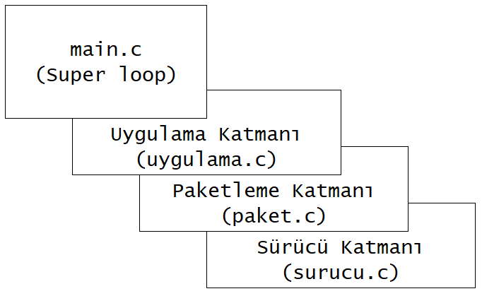

********************************************************************************
C Dilinde Kodlar Nasıl Derlenir?
********************************************************************************

Önceki konularda C dilinde program oluşturma aşamalarını ve hafıza yönetimini
incelemiştik. Yazdığımız kodların; program oluşturma aşamasında önce 
:ref:`Ön İşlemci<preprocessor>`'den geçtiğini ve :ref:`Derleyici<compiler>` 
tarafından işlemci kodlarının oluşturulup :ref:`Bağlayıcı<linker>` ile 
programımızın çalışmaya hazır hale getirildiğini biliyoruz. Bu bölümde 
:ref:`derleyici<compiler>` tarafından kodlarımızın nasıl derlendiğini, bu
işlem sırasında nelere dikkat etmemiz gerektiğini inceleyeceğiz.

C dilinde yazılan her program ``main()`` fonksiyonuna ihtiyac duyar. 
``main()`` fonksiyonu çağırılmadan önce yapılması gereken işlemler genellikle
reset vektörüne yazılır ve işlemler bittikten sonra program ``main()``
fonksiyonuna koşulsuz dallanır. Eğer kodunuzda bir ``main()`` fonksiyonu 
tanımlamazsanız :ref:`Bağlayıcı<linker>` hata verecektir.
   
Dosya Tipleri
================================================================================
   
C dilinde kullanılan dosya tiplerini aşağıda açıklamaya çalıştım.

:index:`Kaynak Dosyası`
--------------------------------------------------------------------------------
   
Kaynak dosyası(İng:source file) kodlarımızın bulunduğu metin tabanlı bir 
dosyadır. Herhangi bir metin editörü veya geliştirme ortamı ile bu dosyaları
hazırlayabiliriz. C dilinde kaynak dosyalarının uzantısı **".c"**'dir.
   
:index:`Başlık Dosyası`
--------------------------------------------------------------------------------
   
Başlık dosyası(İng:header file) kaynak dosyasında bulunan fonksiyon ve 
değişkenlerin diğer kaynak dosyaları tarafından kullanılabilmesini sağlar.
C dilinde başlık dosyalarının uzantısı **".h"**'dir. Başlık dosyaları içinde
fonksiyon prototipleri, kullanılacak tanımlar ve bazı durumlarda 
satıriçi(İng:inline) fonksiyonlar bulunur. Özellikle kod taşınabilirliği ve
modülerlik için başlık dosyalarının düzgün hazırlanması önemlidir.
   
:index:`Birleştirici Dili Dosyası`
--------------------------------------------------------------------------------
   
Birleştirici(İng:Assembler) dili dosyası özellikle C derleyici ortamlarında
başlangıç(İng:Startup) dosyası olarak kullanılır. C ve ASM kodları ayrı ayrı
derlenip linker aracılığı ile program oluşturulur. ASM dosyası 
mikrodenetleyiciye ait açılış vektör yerleşimi, reset vektörü ve özel kodlar
içerebilir. 

Örnek Proje
================================================================================

C dilinde her assembler dosyası ve kaynak dosyası ayrı ayrı derlenerek obje
dosyaları oluşturulur ve bu oluşturulan obje dosyaları linker tarafından 
birleştirilir. Derleme aşamasında kaynak dosyalarının içerdiği başlık
dosyalarının belirli bir sıra ve düzende eklenmiş olması derleme hatalarını,
modüler yapıların korunmasını, eğer katmanlı uygulama yazıyorsanız katmanlar
arası ayrımı ve derlenme süresini optimize edecektir. 

Aşağıdaki şekilde 3 katmanlı bir projeye ait uygulama yapısını görüyoruz. 
**main** modülü özellikle bare-metal programlarda süper döngü(İng.Super loop)
olarak kullanılır.

.. centered:: Örnek uygulama katmanı

Yukarıda örneğini verdiğim katmanlı uygulamalarda genelde üst katmanların 
bir alt katmandan daha aşağı ve alt katmanların üst katmanlara erişmesi
istenmez. Bunun için içiçe eklenmiş başlık(İng.Nested-Header files) 
dosyalarının **kullanılmaması** gereklidir. Aşağıda her bir modül için örnek
kodları bulabilirsiniz.
   
Main Modülü
--------------------------------------------------------------------------------
   
**Main** modülüne ait bir başlık dosyası olmadan da kodlarımız çalışır. Bu 
örnek kodda main modülüne ait bir başlık dosyası kullanmayacağız. 
``uygulama_kontrol`` değişkenine kesme fonksiyonu içinde değer ataması 
yapılmaktadır.

.. literalinclude:: ../../code_snippets/katman_ornek/main.c
   :linenos:
   
Uygulama Modülü
--------------------------------------------------------------------------------
   
* **Kaynak Dosyası** 

.. literalinclude:: ../../code_snippets/katman_ornek/uygulama.c
   :linenos:

* **Başlık Dosyası** 

.. literalinclude:: ../../code_snippets/katman_ornek/uygulama.h
   :linenos:

Paket Modülü
--------------------------------------------------------------------------------

* **Kaynak Dosyası** 

.. literalinclude:: ../../code_snippets/katman_ornek/paket.c
   :linenos:

* **Başlık Dosyası** 

.. literalinclude:: ../../code_snippets/katman_ornek/paket.h
   :linenos:

Sürücü Modülü
--------------------------------------------------------------------------------

* **Kaynak Dosyası** 

.. literalinclude:: ../../code_snippets/katman_ornek/surucu.c
   :linenos:

* **Başlık Dosyası** 

.. literalinclude:: ../../code_snippets/katman_ornek/surucu.h
   :linenos:

Derleme Açıklamaları
================================================================================

Yukarıdaki örnek proje derlenirken hangi modülün önce derlendiğinin bir önemi
yoktur ve tüm modüller kendi başlarına derlenebilir modüllerdir. Bu sayede 
**paketleme** katmanına ait kaynak ve başlık dosyası başka bir projeye 
taşınabilir ve *paketleme* katmanı sadece bir *sürücü* katmanına ihtiyaç
duymaktadır. Yeni projede *sürücü* katmanı yukarıdaki standardda yazılmış 
ise paketleme katmanınız sorunsuz çalışacaktır. 
   
.. note::
   
   Yukarıdaki örnekte başlık dosyaları hiçbir ``#include`` direktifine sahip
   değildir. Çok gerekmedikçe ben başlık dosyaları içinde özellikle projeye ait
   diğer modüllerin başlık dosyalarının içerilmesini önermiyorum. Eğer 
   *uygulama.h* dosyası içinde *paket.h* içerilse idi **main** modülünden 
   **paket** modülü fonksiyonlarına erişebilirdiniz. 
   
   Bu tarz kontrolsüz erişimler mantık hataları yapılmasına yardımcı olur.
   Main modülü içinde ``Uygulama_Init()`` fonksiyonu çağırılmadan 
   ``Paket_Gonder()`` fonksiyonu çağırılır ise istenmeyen sonuçlar ortaya 
   çıkacaktır. 
