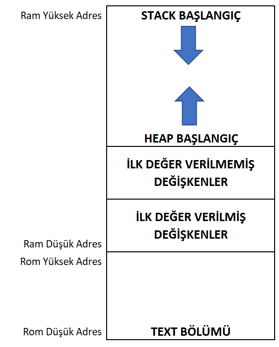

.. comment

   Copyright 2019 İbrahim USLAN(IBeRyUS) - mixer_opq@hotmail.com

   Licensed under the Apache License, Version 2.0 (the "License");
   you may not use this file except in compliance with the License.
   You may obtain a copy of the License at

      http://www.apache.org/licenses/LICENSE-2.0

   Unless required by applicable law or agreed to in writing, software
   distributed under the License is distributed on an "AS IS" BASIS,
   WITHOUT WARRANTIES OR CONDITIONS OF ANY KIND, either express or implied.
   See the License for the specific language governing permissions and
   limitations under the License.

********************************************************************************
C Dilinde Hafıza Yönetimi
********************************************************************************

Assembler dili ile kod yazmış olanlar RAM ve ROM yönetimine gayet aşinadır. 
Her bir değişkene ait adresi, sabit değerlerin adreslerini ve bunların  
yerleşimlerini ayarlamanız gerekmektedir. Kullanılan işlemci mimarisine göre 
reset ve kesme vektörlerini, özel adresleri (Bir örnek: NXP işlemcilerde kod 
koruma için gereken şablon değeri kodun bulunduğu ROM üzerine kaydedilmelidir
. LPC176x serisi için bu adres 0x000002FC'dir) de ayarlamanız gerekmektedir. 
Genelde işlemci üreticileri mimariye ait yerleşim dosyalarını sağlasa dahi 
kendi kodunuzda kullandığınız değişken ve sabit değerleri ayarlamak 
zorundasınız.

Bütün üst seviye dillerde olduğu gibi C dilinde de hafıza yerleşimi ve adres
yönetimi genel olarak dil bileşenleri tarafından yönetilir. C dilinde 
ihtiyacımız olan değişken ve büyüklüğünü belirtmemiz çoğu durumda yeterlidir.

Hafıza Elemanları
================================================================================

Mikrodenetleyicilerde hafıza en basit hali ile RAM, ROM ve donanım adres bloğundan
oluşur. Genel olarak ROM üzerinde çalışan program, RAM üzerinde dinamik 
saklanan verilerimiz ve donanım adres bloğunda mikrodenetleyicinin dış dünya 
ile etkileşimini sağlayan donanımlar bulunur. Bu bölümde ROM ve RAM hafıza 
yönetimine ait kısım ile ilgileneceğiz. **Donanım** bloğuna ait tanımlamaları
daha sonra inceleyeceğiz.

C Diline Ait Hafıza Terimleri
================================================================================

Bu bölümde C dilinin hafıza yönetiminde kullandığı terimleri çok fazla detaya
inmeden anlatmaya çalışacağım. 

*  **STACK:** Türkçe'ye yığın/yığıntı olarak çevirilmiştir. :index:`Stack`
   son giren ilk çıkar(LIFO) şeklinde çalışan bir depolama alanıdır. Stack 
   fonksiyon girişlerinde ALU register(lar)ını, geri dönüş adresini, ve
   fonksiyonların lokal değişkenlerinin saklandığı RAM alanıdır. Bizim en çok
   dikkat etmemiz gereken fonksiyon lokal değişkenlerinin burada saklanıyor 
   olmasıdır. Aşağıdaki şekilde Stack başlangıcının RAM'in en yüksek adresi
   olduğunu görüyoruz. Bu işlemci mimarisi ile de alakalıdır. Çoğu mimaride 
   Stack adresi işlemci tarafından yönetilebilir. Mesela ``ARM Cortex`` 
   mimarisinde R13 registeri stack pointer(SP) olarak çalışır ve aşağı yönlü
   büyür. Aşağıdaki şekilde gösterilen hafıza yerleşimi ``ARM Cortex`` 
   mimarisine uyumludur.
   
   |1_empty_line_latex| |1_empty_line_html|

*  **HEAP:** Türkçe'ye yığın/alt yığın olarak çevirilmiştir. 
   :index:`HEAP` program tarafından çalışma esnasında (:index:`run-time`)
   dinamik olarak ihtiyaç duyulan değişkenlerin sağlandığı bloktur. Statik
   tanımlanmış değişkenlerden hemen sonra başlar ve yukarı yönlü büyür.
   ``malloc``, ``printf``, ``sprintf`` vb. tüm run- time da çalışan
   fonksiyonlara ait dinamik RAM istekleri buradan karşılanır. Gömülü
   sistemlerde bu bölge kullanıcı kodlarında mümkün olduğunca kullanılmaz. 
   Özellikle malloc ve free fonksiyonları ile sürekli RAM bloğu alıp verme 
   sonucunda bellek parçalanmasına sebep olur.(İng.memory fragmentation)
   Bunun sonucunda ``HEAP`` alanı ``STACK`` alanına taşar ise sistemin
   kararsız hale gelmesine yol açabilir. ``HEAP`` alanı bellek 
   parçalanmasından dolayı yetersiz kalır ise programın ihtiyacı olan RAM 
   ihtiyacı karşılanamadığı için programda istenmeyen sonuçlar oluşabilir.

   |1_empty_line_latex| |1_empty_line_html|

*  **TEXT:** Text bölümü kodun ve sadece okunabilir bilgilerin saklandığı
   alandır. Mikrodenetleyicilerde bu bölümde reset ve kesme vektörleri de
   bulunur. Bu kısım aynı zamanda ilk değer verilmiş değişkenlerin
   değerlerini de saklar.
   
   |1_empty_line_latex| |1_empty_line_html|

*  **ILK DEGER VERILMIS DEGISKENLER:** Bootstrap sırasında sadece okunabilir
   hafızada saklanan veriler bu alana kopyalanarak programın düzgün bir
   başlangıç ile başlamasını sağlar. Bu alanın büyüklüğü direk olarak ROM
   üzerine yazılacak imaj dosyasının büyüklüğünü etkileyecektir. 

   |1_empty_line_latex| |1_empty_line_html|

*  **ILK DEGER VERILMEMIS DEGISKENLER:** Bu alan RAMde tanımlanmış 
   değişkenlerin tutulduğu alandır. Bu alanın ilk değeri kod tarafından
   tanımlanmaz. Bazı kodlar bu alanı direk 0 değeri ile doldururken bazı
   kodlar mikrodenetleyicinin reset anındaki rastgele değeri ne ise o şekilde
   bırakır. Seri porttan gelecek dataların saklandığı bir tampon alanını
   sıfırlamaya genelde gerek olmaz çünkü alıma başladıktan sonra gelen
   verileri bu alandaki verinin üzerine yazılacak ve ilk değerin bir önemi
   yoktur.
   

   
.. centered:: C Hafıza Yerleşimi

.. |1_empty_line_latex| raw:: latex
   
   \vspace{5mm}

.. |1_empty_line_html| raw:: html

    
