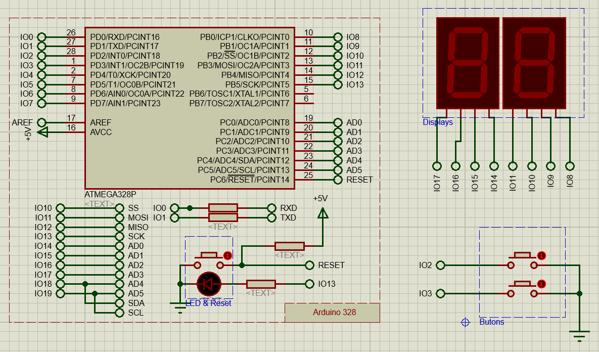

********************************************************************************
7 Segment BCD
********************************************************************************

İlk örnek  olan :doc:`Aşağı Yukarı Sayıcı<01_7_segment/ornek_01>` örneğinde 
farklı şekillerde yazılmış kod örnekleri verdim. Özellikle farklı şekillerde kod
yazmak direk kod yazmaktan çok daha fazla vakit alıyor. O yüzden diğer örnekler
için bir örnek vermeyi planlıyorum. Çok gerekli olmadıkça diğer alıştımalarda 
farklı kod örnekleri yazmayacağım.

İlk örnekte yeni başlayanlara kolaylık olması için 7 segment LED display BCD ->
7 Segment Decoder (örnek |4056_link_html| |4056_link_latex|) entegre edilmiş 
direk BCD sürülebilen ekranlar seçtim.

.. |4056_link_html| raw:: html

   <a href="https://www.st.com/resource/en/datasheet/cd00002658.pdf" 
   target="_blank">4056</a>
   
.. |4056_link_latex| raw:: latex
   
   \href{https://www.st.com/resource/en/datasheet/cd00002658.pdf}{4056}

Bağlantı Şeması
================================================================================

Aşağıdaki şemada ATmega328p mikrodenetleyicisine bağlanmış iki adet 7 segment
LED display ve iki buton bulunmaktadır. Şema simulasyon için yeterli
elemanlara sahiptir.

.. centered:: 7-Segment BCD Şema

|7_segment_link_html| |7_segment_link_latex|.

.. |7_segment_link_html| raw:: html

   <a href="https://github.com/IBeRyUS/Gomulu_Sistemler/raw/aba1374c968c5e9a0592008b6c97eff6c7478bfc/packed/7segment.7z"
   target="_blank">Buradan bu örneğe ait proje dosyasını indirebilirsiniz</a>

.. |7_segment_link_latex| raw:: latex

   \href{https://github.com/IBeRyUS/Gomulu_Sistemler/raw/aba1374c968c5e9a0592008b6c97eff6c7478bfc/packed/7segment.7z}
   {Buradan bu örneğe ait proje dosyasını indirebilirsiniz}

Örnek Uygulamalar
================================================================================
   
Yukarıdaki bağlantı şeması ile birlikte aşağıdaki örnekleri kullanabilirsiniz.

.. toctree:: 
   :maxdepth: 1
   :numbered:
   :glob:
   
   01_7_segment/*
