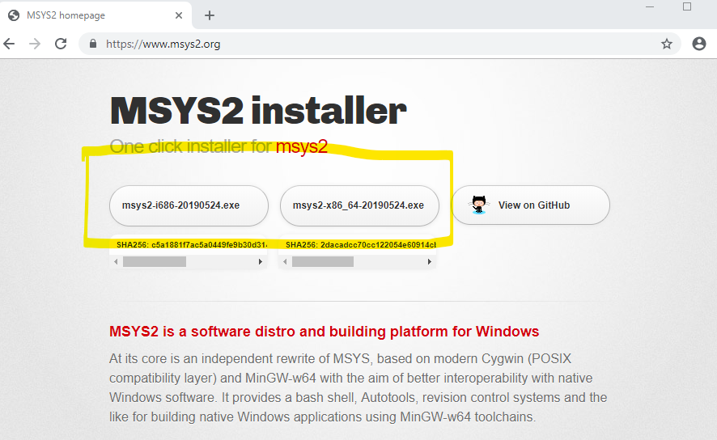
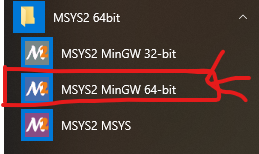
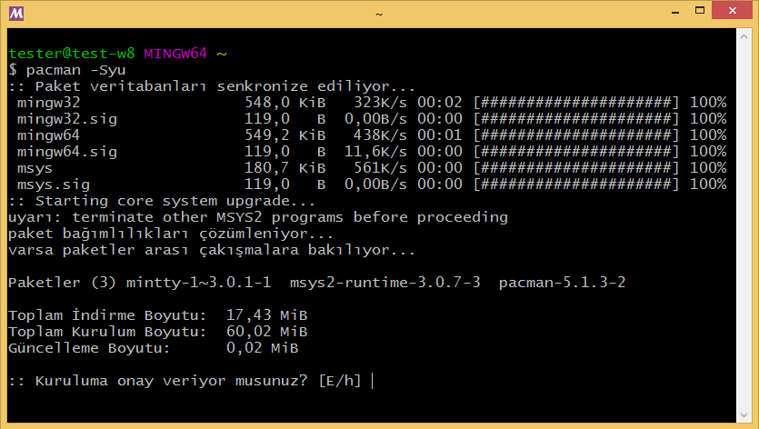
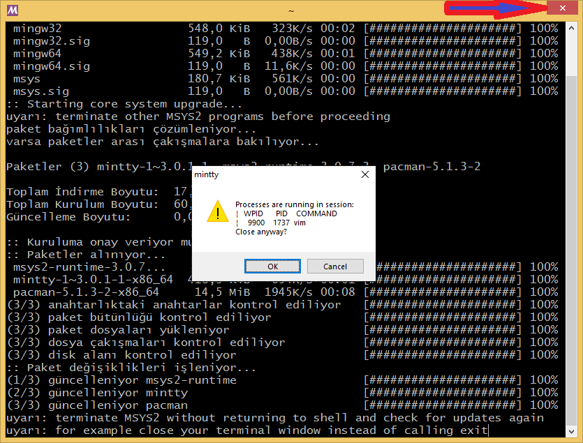
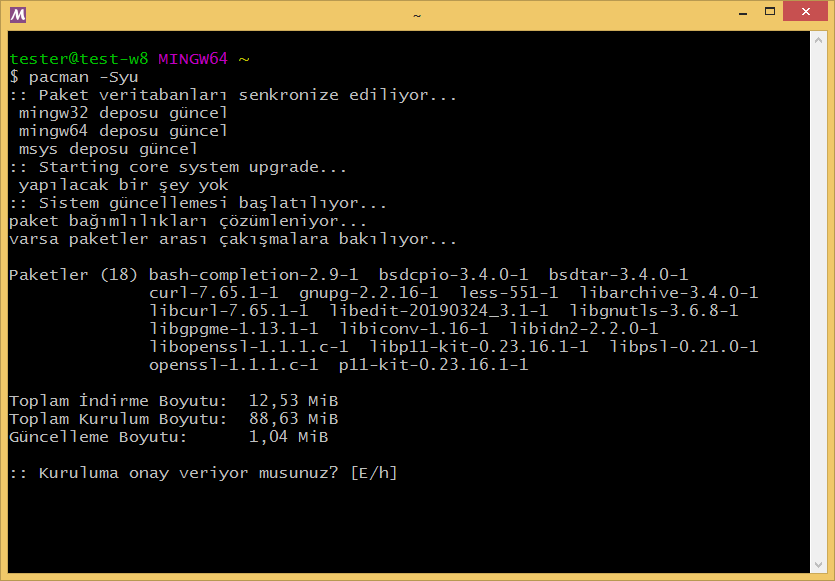
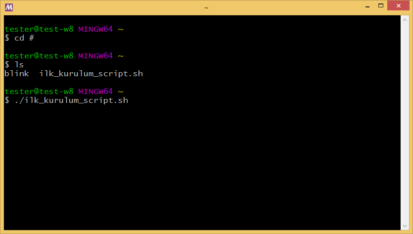

.. comment

   Copyright 2019 İbrahim USLAN(IBeRyUS) - mixer_opq@hotmail.com

   Licensed under the Apache License, Version 2.0 (the "License");
   you may not use this file except in compliance with the License.
   You may obtain a copy of the License at

      http://www.apache.org/licenses/LICENSE-2.0

   Unless required by applicable law or agreed to in writing, software
   distributed under the License is distributed on an "AS IS" BASIS,
   WITHOUT WARRANTIES OR CONDITIONS OF ANY KIND, either express or implied.
   See the License for the specific language governing permissions and
   limitations under the License.

################################################################################
:index:`MSYS2` Kurulumu
################################################################################

MSYS2 platformu en sade hali ile Windows üzerinde çalışan bir Bash terminal
emülatorüdür. Kurulum için gerekli olan bileşenler:

   #. İnternet bağlantısı
   #. |msys2_wp_link_html| |msys2_wp_link_latex|
   #. |kurulum_script_link_html| |kurulum_script_link_latex|

|msys2_wp_link_html| |msys2_wp_link_latex| websitesinden en son
paketlenen sürümünü indirip kurun. 64-bit sürümünü kurmanızı tavsiye ederim.

   
Kurulum bittikten sonra başlat menünüze MSYS2 klasörü gelecektir. Başlat
menüsünden **MSYS2 MinGW 64-bit** olan sürümü çalıştırın.

Açılan terminal ekranına ``pacman -Syu`` komutunu yazıp onaylayın. 

Sistem güncellemesi yapıldıktan sonra terminal penceresini direk kapatmanızı 
isteyen bir not göreceksiniz. Terminal ekranın sağ üst köşesindeki **X** kapatma
düğmesine tıklayarak pencereyi kapatın. Tıkladığınızda bir uyarı verecektir 
onaylayıp pencereyi kapatın.

Tekrar **MSYS2 MinGW 64-bit** terminalini açın. Az önce verdiğimiz 
``pacman -Syu`` komutunu tekrar yazıp çalıştırın. Bu sefer sistem güncellemesi
değil kurulu paketlerin güncellenmesini onaylamanızı isteyecektir. Onaylayıp 
kurulumun bitmesini bekleyin.

Güncellemeler bittikten sonra |kurulum_script_link_html|
|kurulum_script_link_latex| dosyasını indirip MSYS2 kullanıcı kllasörüne
kopyalayın. MSYS2 kullanıcı klasörü MSYS2 kurulum klasörü altında 
**\\home\\KullanıcıAdı\\** klasörüdür. Klasöre kopyaladıktan sonra terminalde 
``cd #`` veya ``cd ~`` komutunu verin. ``ls`` komutu ile dizin içeriğini
listeleyin. Listede **ilk_kurulum_script.sh** dosyasını gördükten sonra 
``./ilk_kurulum_script.sh`` komutu ile kurulumu başlatın.

Kurulum süresi bağlantı hızınız, işlemci hızını vb. etkenlere göre değişiklik
gösterir ve 1-5 dk. sürebilir. Terminal ekranında durumu izleyebilirsiniz.
Kurulum bittikten sonra ARM GNU toolchain bilgisayarınıza kurulmuş olacaktır. 

.. |msys2_wp_link_html| raw:: html

   <a href="https://www.msys2.org/"
   target="_blank">MSYS2</a>
   
.. |msys2_wp_link_latex| raw:: latex

   \href{https://www.msys2.org/}
   {MSYS2}

.. |kurulum_script_link_html| raw:: html

   <a href="https://raw.githubusercontent.com/IBeRyUS/Gomulu_Sistemler/521705a34a6dbaf0a705f55bfdcace467305f158/code_snippets/ilk_kurulum_script.sh"
   target="_blank">İlk Kurulum Script</a>
   
.. |kurulum_script_link_latex| raw:: latex

   \href{https://raw.githubusercontent.com/IBeRyUS/Gomulu_Sistemler/521705a34a6dbaf0a705f55bfdcace467305f158/code_snippets/ilk_kurulum_script.sh}
   {İlk Kurulum Script}
