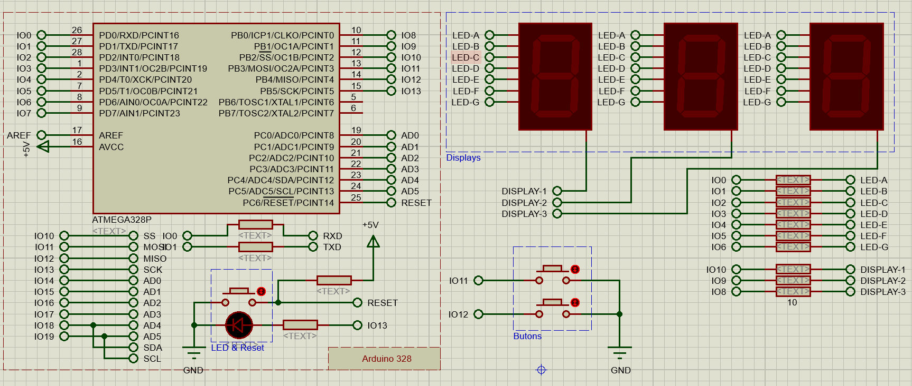

.. comment

   Copyright 2019 İbrahim USLAN(IBeRyUS) - mixer_opq@hotmail.com

   Licensed under the Apache License, Version 2.0 (the "License");
   you may not use this file except in compliance with the License.
   You may obtain a copy of the License at

      http://www.apache.org/licenses/LICENSE-2.0

   Unless required by applicable law or agreed to in writing, software
   distributed under the License is distributed on an "AS IS" BASIS,
   WITHOUT WARRANTIES OR CONDITIONS OF ANY KIND, either express or implied.
   See the License for the specific language governing permissions and
   limitations under the License.

********************************************************************************
7 Segment Tarama
********************************************************************************

7 Segment tarama projesinde BCD decoder bağlanmış displayler yerine 8 girişli 7 
segment displayler kullanılmıştır. Basamak sayısı 3'e çıkartılmış ve 
displaylerdeki değerler sabit çıkış yerine sürekli tarama yapılarak 
gösterilmiştir. 

Bağlantı Şeması
================================================================================

Aşağıdaki şemada ATmega328p mikrodenetleyicisine bağlanmış üç adet 7 segment
LED display ve iki buton bulunmaktadır. Şemada kullanılan bütün dirençler 
**Proteus**'da digital olarak seçilmiştir. Bu özellik ile digital bağlantılarda 
kullanılan dirençler simulasyon esnasında analog hesaplamalara tabi tutulmaz.
Bu sayede simulasyon daha hızlı çalışır.

.. centered:: 7-Segment Tarama Şeması

|7_segment_link_html| |7_segment_link_latex|.

.. |7_segment_link_html| raw:: html

   <a href="https://github.com/IBeRyUS/Gomulu_Sistemler/raw/0ed19a322e8d1c8feff35db762113fd17692f7d7/packed/02_7_segment.7z"
   target="_blank">Buradan bu örneğe ait proje dosyasını indirebilirsiniz</a>

.. |7_segment_link_latex| raw:: latex

   \href{https://github.com/IBeRyUS/Gomulu_Sistemler/raw/0ed19a322e8d1c8feff35db762113fd17692f7d7/packed/02_7_segment.7z}
   {Buradan bu örneğe ait proje dosyasını indirebilirsiniz}

Örnek Uygulamalar
================================================================================
   
Yukarıdaki bağlantı şeması ile birlikte aşağıdaki örnekleri kullanabilirsiniz.

.. toctree:: 
   :maxdepth: 1
   :numbered:
   :glob:
   
   ../02_7_segment/stm32_*
